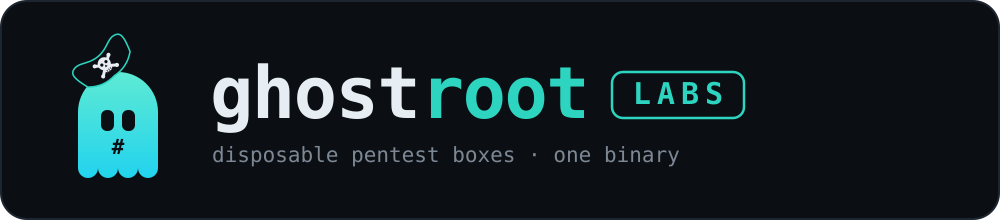

<p align="center">
  
</p>

<h1 align="center">Offensive security that leaves nothing behind.</h1>

<p align="center">
  <a href="https://github.com/ghostroot-labs/ghostroot"></a>
  
  
  
</p>

---

**Ghostroot Labs** builds offensive-security tooling with the operational
discipline of people who take opsec seriously. Get in, do the work, leave
no trace.

## ghostroot

One binary to spin up, manage, and tear down disposable, fully-loaded pentest
containers and red team infrastructure — with the VPN kill-switch, scope enforcement, and panic-wipe
built in. AI-native: drive it yourself, or let Claude / Codex / any MCP
client run the engagement.

```bash
curl -fsSL https://raw.githubusercontent.com/huntOS-git/ghostro/main/install.sh | sh
ghostroot start HTB-box --image ad     # 115 ms to a loaded shell
```

**[ghostroot-labs/ghostroot](https://github.com/ghostroot-labs/ghostroot)** ·
AGPL-3.0 · macOS + Linux · zero telemetry

---

*Authorised use only. We test what you own or have written permission to test.*
